# Kurzfassung

# Inhalt

[toc]

***

# 1. Einleitung

## 1.1 Motivation

Modelle auf der Basis von Machine-Learning-Algorithmen können eine zentrale Rolle bei der strategischen Steuerung von Energiekreisläufen spielen. Sie werden mit dem Ziel eingesetzt, die Energieproduktion zu prognostizieren, um insbesondere die Nutzung der oft volatilen, regenerativen Quellen zu optimieren. Dabei steht die zeitliche Entzerrung des Verbrauchs, sowie die Speicherung und Umwandlung von elektrischer Energie im Vordergrund.

[**Abbildung 1:** Prognosekurven für die Leistung einer PV-Anlage]

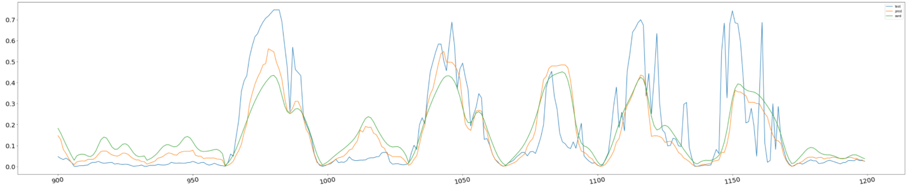

Als Beispiel für einen Stromproduzenten mit erheblichen Leistungsschwankungen sei hier Photovoltaik genannt. Es liegt im Interesse des Investors in eine derartige Anlage, den dort produzierten Strom auch direkt zu nutzen. Daraus ergibt sich ein ökonomischer Vorteil, wenn die Einnahmen für die Einspeisung ins Netz unter den Kosten für den Bezug von Strom liegen. Die Leistung von PV-Paneelen ist jedoch durch den Tageszyklus und das Wetter bedingt, so dass die Abnahme nach Möglichkeit strategisch zu planen ist. Ein Beispiel für einen intelligent gesteuerten Verbrauch ist die Manipulation von Ladevorgängen bei elektrischen Fahrzeugen, welche sich aus dem Teilnetz bedienen. Wird der Ladeprozess entsprechend der variablen Stromproduktion der PV-Anlage angepasst, dann kann vorwiegend diese lokal erzeugte, regenerative Energie gespeichert werden. Der Strombezug aus dem Netz wird dadurch reduziert und die Basislast beim Netzbetreiber gesenkt.

Eine derartige Steuerung ist jedoch mit dem Kunden zu verhandeln, da dieser eventuell längere Ladezeiten in Kauf nehmen muss. Daher ist es entscheidend Prognosen, für die etwaige Ladeleistung abzugeben. Dafür müssen wiederum die Produktion der Photovoltaikanlagen und die sonstigen Verbrauchsströme vorhergesagt werden. Die dafür eingesetzten ML-Modelle sind Schwerpunkt dieser Arbeit.

## 1.2 Problemstellung

Die Prognose von Energieströmen fällt in die Kategorie der Zeitreihenprobleme, d.h. wir möchten den Verlauf einer Größe - hier die elektrische Leistung in Kilowatt - über die Zeit vorhersagen. Ähnliche Fragestellungen sind auch in anderen Themengebieten zu finden, wie zum Beispiel bei der Prognose von Börsenkursen oder der Passagierzahlen an Flughäfen. Als Eingabedaten für entsprechende ML-Modelle kommen Zeitreihen zum Tragen, also Datensätze, die vorhandene Werte mit Zeitstempeln paaren. Jedoch lassen sich zwei Obergruppen für die Lösungsstrategien ausmachen:

**A. Zeitgleiche Daten:** Bei diese Ansatz wird über einen Feature-Vektor `X(t)` von Werten zum Zeitpunkt `t` aus einer Domäne auf eine zu prognostizierenden Variable `y(t)` geschlossen.  Dabei ist das Feature y nicht in X enthalten, der Zeitstempel aber identisch. Dies ist die eher klassische Strategie bei Regressionsmodellen oder FNNs (Feedforward Neural Networks). So könnte zum Beispiel über die Wettervorhersage (Temperatur, Sonnenstand, Wolkenbedeckung) die Solarstromproduktion vorhergesagt werden. Die Problemstellung für eine Zeitreihenprognose liegt hier in der Art der Eingabedaten: Soll in die Zukunft geschaut werden, dann sind auch die genutzten Daten oft Prognosen und somit fehlerbehaftet. Schlägt das Wetter wider Erwarten um, so wird die PV-Anlage ebenso andere Leistungswerte zeigen.

**B.  Historische Daten:** Der Gegenentwurf ist die Nutzung von historischen Daten als Eingabe für die Vorhersage. Damit ist nicht das Modelltraining beschrieben, welches meist auf historischen Daten `X` mit bekannten Label-Werten `y` basiert, sondern der eigentliche Prognosedurchlauf: Wir möchten aus einer Vergangenheit direkt auf eine Zukunft schließen, die Kurve also mittels Mustererkennung fortschreiben. Dabei kann sich die Zahl der Features soweit reduzieren, dass am Ende nur der zurückliegende Verlauf von `y(t - n)` für die Extrapolation der Werte `y(t + m)` verwendet wird. In diesem Fall liegen  Ein- und Ausgabe im gleichen Feature-Raum. Ein solcher Ansatz ist dann attraktiv, wenn keine zukünftigen Werte aus anderen Features `X(t + m)` als sinnvolle Eingaben zur Verfügung stehen oder wenn diese nur unpräzise Aussagen liefern.

[**Abbildung 2:** Prognosekurven für Passagiere via LSTM]

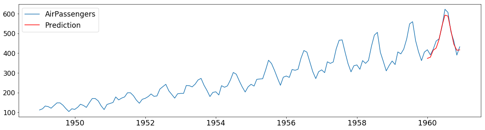

Für den zweiten Ansatz finden - neben verschieden Schiebefenstermethoden - neuronale Netze Verwendung, welche sequenzielle Daten verarbeiten können. Zu diesen gehören u.a. das einfache RNNs (Recurrent Neural Network) und die darauf aufbauende Architektur LSTM (Long Short-Term Memory). Diese Arbeit soll die Grundlagen dieser Netze erläutern und untersuchen, inwieweit sie sich für die Vorhersage von Stromverbrauchszyklen eignen. 

## 1.3 Vorgehen und Aufbau der Arbeit

**DSR:** Für diese Arbeit wird der Design-Science-Research-Methodik gefolgt: Vor dem Hintergrund der konkreten Aufgabenstellung, werden experimentelle Machine-Learning-Modelle entwickelt und analysiert. Damit wird durch praktische Umsetzung eines Lösungsvorschlags und dessen Evaluierung Wissen generiert.

Die Ausarbeitung gliedert sich wie folgt:

**Grundlagen:** In diesem Kapitel werden zunächst die wesentlichen Merkmale der gewählten ML-Modelle erläutert. Dies sind das einfache RNN und die Erweiterung LSTM. Die mathematischen Grundlagen sollen hier angerissen werden, um auf Vorteile und Schwächen dieser beiden Architekturen zu schließen. Gleichzeitig wird die folgende Implementierung hier theoretisch untermauert.

**Konzeption:** In diesem Abschnitt werden die Anforderungen gelistet und der technische Lösungsvorschlag vorgestellt. Das Anwendungsfeld wird präzisiert und die vorhandenen Daten beschrieben. Aus diesen Vorgaben erschließt sich die Wahl der ML-Modelle und Frameworks für die Implementation. Zuletzt müssen hier die Strategien zur Evaluation und der Aufbau von Vergleichsexperimenten erläutert werden.

**Implementation:** Dieses Kapitel beschreibt und dokumentiert die Implementation. Der Code, welcher vorwiegend in Form von kommentierten Jupyter Notebooks vorliegen wird, soll hier überblickshaft erläutert werden. Auf interessantere Bausteine wird im Detail eingegangen.

**Evaluation:** Da es sich bei der Implementation um eine Reihe von Data-Science-Experimenten handelt, sollen die generierten Prognosedaten in diesem Abschnitt evaluiert werden. Es erfolgt eine Bewertung anhand von Metriken sowie eine qualitative Inspektion der Ergebnisse.

**Fazit: ** Zum Abschluss werden die innerhalb dieses Forschungsprojekts gewonnenen Erkenntnisse zusammengefasst. Insbesondere Schwierigkeiten und ungelöste Fragen werden erläutert. Ein Ausblick auf weiterführende Ansätze für eine zukünftige Lösung der offenen Problemstellungen rundet die Arbeit ab.

***

# 2. Grundlagen

In diesem Kapitel soll der grundsätzliche Aufbau von zwei rekurrenten neuronalen Netzen beschrieben werden: Im ersten Schritt wird das einfache RNN erläutert, welches der Ausgangspunkt für viele fortgeschrittene Architekturen ist. Eine dieser Erweiterungen ist das LSTM, welches sich im zweiten Teil findet.  

## 2.1 Recurrent Neural Network

### 2.1.1 Was ist ein RNN?

Die Abkürzung RNN steht für rekurrentes neuronales Netz. Es handelt sich dabei um eine Netzarchitektur, die eine lange Folge von Daten verarbeiten kann. Die Besonderheit bei der sequenziellen Betrachtung des Datenstroms, liegt im Erinnerungsvermögen: Das Modell kennt nicht nur den aktuellen Datenpunkt sondern bezieht auch den durch vorangegangene Eingaben erreichten Zustand in jeden neuen Berechnungsschritt ein. Es handelt sich also um eine Generalisierung eines Feedforward-Netzes, welche eine Form von Gedächtnis besitzt. Das RNN vollführt die gleiche Kalkulation für jeden Input-Vektor X<sub>t</sub>, erhält aber als zusätzliche Eingabe auch die Ausgaben h<sub>t-1</sub> der letzten Berechnung - der Mechnismus ist demnach rekursiv. Die sequenzielle Verknüpfung der Berechnungen macht hier den charakteristischen Unterschied aus. Im strukturellen Vergleich zu einem herkömmlichen FNN lässt sich erkennen, das ein RNN das FNN gedanklich mehrfach kopiert und den Zustand einer jeden Instanz in die folgende überträgt. In dieser entfalteten Perspektive wird die Verkettung deutlich. Die Kopie wird in der Realität jedoch vermieden und durch einen schleifenförmigen Datenfluss ersetzt.

[**Abbildung 3:** RNN in zyklischer und entfalteter Systemdarstellung]

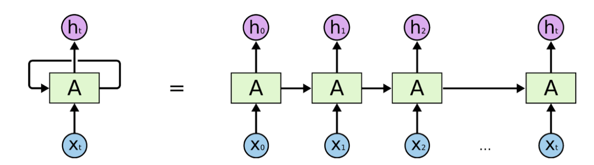

Mathematisch lässt sich dieser Aufbau wie folgt fassen:

[**Formel 1:** Mathematische Beschreibung eines RNN]

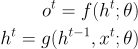

Der Ausgabewert o<sup>t</sup>  ergibt sich durch die Funktion f. Diese arbeitet über den Zustand h<sup>t</sup> der versteckten Schichten mit den Parametern &theta;. Die zweite Formel zeigt, das h<sup>t</sup> sich aber als eine Funktion der Eingabewerte x<sup>t</sup> sowie des Zustands des vorangegangenen Berechnungsschritts h<sup>t-1</sup> darstellt. In Abbildung 4 ist die eigentliche Vernetzung der Neuronen mit den entsprechenden Querverbindungen (gelb) zwischen den Zuständen der inneren Schichten illustriert. Hier wird deutlich, dass jede Zelle A ein vollständiges Fully Connected Network ist. 

[**Abbildung 4:** RNN Netzwerkverbindung und Transfer zum Systemdiagramm]

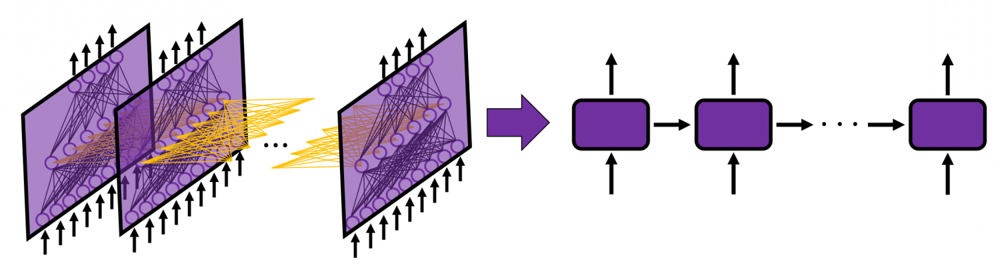

**Anmerkung:** In den unterschiedlichen Quellen kommt es zu diversen Aussagen darüber, ob es sich bei den übertragenen Werten h<sup>t-1</sup> um die Ausgabe des voran gegangenen Berechnungsschrittes o<sup>t</sup>, oder um einen inneren Zustand handelt. Viele vereinfachende Datenflussdiagramme legen ersteres nahe, doch ist in der Mathematik und in Abbildung 4 zu erkennen, dass die Verknüpfung zur Ausgabeschicht o<sup>t</sup> anders gestaltet sein können als die horizontalen Verbindungen im inneren des Netzes. Es sind dementsprechend nicht die Ausgabewerte, die beim nächsten Berechnungsschritt erneut in das Netz gespeist werden. h<sup>t</sup> und o<sup>t</sup> gleich zu setzen ist eine unzulässige Verkürzung.

### 2.1.2 Backpropagation über Zeit (BPTT)

Das Training von RNN ist dem eines FNN sehr ähnlich: Auch hier erhalten wir über die Kostenfunktion eine mehrdimensionale "Kostenlandschaft", die via Gradientenabstieg zum Minimum hin beschritten werden kann. Für die Ermittlung der entsprechenden Gradienten benötigen wir wiederum das Backpropagation-Verfahren, diesmal aber über die Zeit. Diese Version arbeitet konzeptionell über das Ausrollen (s.o.) des Netzes. Daraus ergibt sich eine Form, die einem FNN gleicht, aber alle Eingaben x<sup>t</sup> als Input-Schicht und alle Ausgaben o<sup>t</sup> als eine Output-Schicht betrachtet. Der genaue Mechanismus ist natürlich noch etwas komplexer und beinhaltet auch Optimierungsstratgien wie das Teacher Forcing. Dies soll beim gegebenen Umfang der Arbeit aber nicht im Detail erläutert werden. Das Grundkonzept der BPTT ist jedoch für das Verständnis einer Gradientenproblematik relevant.

 ### 2.1.3 Vanishing Gradient

[**Abbildung 5:** RNN Vanishing Gardient]

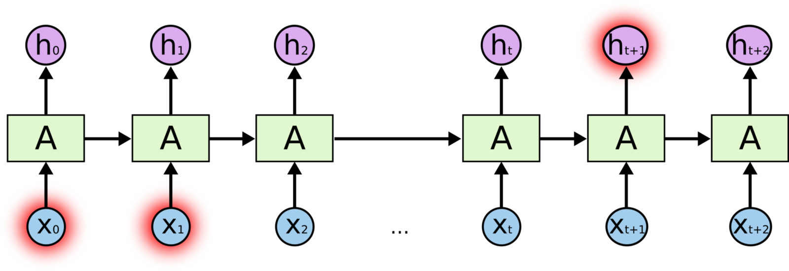

Durch das Berechnen des Gradienten in die Vergangenheit entsteht eine zum Teil extrem lange Kette von Neuronen, die jeweils eine partielle Ableitung nach sich ziehen. Bei der Verknüpfung dieser Teilableitungen mittels der Kettenregel werden die Gewichte verkürzt gesprochen wiederholt miteinander multipliziert. Sind nun diese Gewichte W im Schnitt kleiner als 1, dann erhalten wir eine Multiplikationskette von Werten < 1. Dies bedeutet, dass der Gradient gegen 0 gehen wird und praktisch verschwindet. Gerade bei sigmoiden Aktivierungsfunktionen sind aber Ausgaben < 1 zu erwarten. Diese Problemstellung ist auch aus sehr tiefen neuronalen Netzen bekannt. In der ResNet-Architektur wird ihr u.a. über Sprungverbindungen begegnet. Da RNNs in dieser Hinsicht als extrem tiefe Netze zu werten sind und die einzelnen Schichten zudem als verwandte Variationen enstehen, ist diese Entwicklung hier dramatisch. Bei Gewichten, die > 1 sind, kommt es dagegen zu einem explodierenden Gradienten. Daher ist auch ein Wechsel der Aktivierungsfunktion (z.B. ReLu) nicht immer zielführend. Ein verschwindender Gradient führt schließlich zu einer Stagnation des Lernfortschritts beim Training des Modells. Information geht über die Zeit verloren und das Gedächtnis des Netzes bleibt kurz.

## 2.2 LSTM Long Short-Term Memory

### 2.2.1 LSTM Memory Zelle

Der Herausforderung des verschwindenden Gradienten begegnen fortschrittlichere Netzwerkarchitekturen wie das LSTM, durch eine umfassende Erweiterung der RNN-Zelle (in Abbildung 3 mit A bezeichnet). Die übergeordnete Struktur gleicht zunächst einem einfachen rekurrenten Netzwerk: In Abbildung 5 ist zu erkennen, das auch die modifizierte Zelle als Eingaben den aktuellen Datenvektor x<sup>t</sup> sowie die vorangegangene Ausgabehypothese h<sup>t-1</sup> erhält. Die berechnete Ausgabe wird äußerlich auch wie gehabt an die Folgezelle weiter gereicht. Daneben wird aber als eine Art Schnellstraße für das Gedächtnis eine zusätzlicher Zustand C<sup>t</sup> eingeführt, der ebenso horizontal durch das Netzwerk wandert.

[**Abbildung 6:** Verschaltung RNN vs LSTM]


### 2.2.2 LSTM Gates

[**Abbildung 7:** LSTM-Zelle mit Gates als Funktionen]

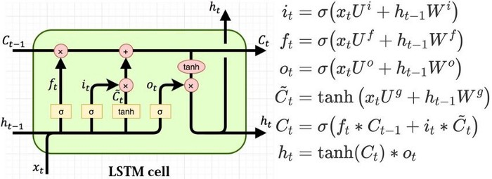

Im inneren der Zelle steigt die Komplexität jedoch deutlich: Neue Funktionen, die als Gates bezeichnet werden, erlauben es, Information zu C addieren (erinnern) oder aus C zu entfernen (vergessen).

**f<sub>t</sub> Vergessen:** Die Reduktion (forget) von Information kann durch eine Multiplikation der entsprechenden Matrizenposition mit einem Wert im Intervall [0, 1] erreicht werden - dies ist vom Vanishing Gradient her bekannt. Diese Bremswerte werden durch das Einspeisen der Eingaben x<sub>t</sub> und h<sub>t-1</sub> in die Sigmoid-Funktion erzeugt. Die entsprechende Verknüpfung löscht demnach selektiv das Gedächtnis C.

**i<sub>t</sub> Erinnern:** Das Einfügen (insert) von Information kann einfach durch positionsweise Addition erfolgen. Die an diesen Strängen vorgeschalteten sigmoiden Funktionen passen lediglich die Wertebereiche günstig an, um Werteexplosionen zu verhindern.

**o<sub>t</sub> Ausgabe:** Auch die Ausgabe (out) wird durch entsprechende Gates manipuliert. Das Ergebnis wird via Multiplikation zusätzlich durch den aktuellen Gedächtniszustand beeinflusst, bevor es als Prognose hervor geht und wie schon beim klassischen RNN auch in die Folgezelle wandert.

### 2.2.3 Vorteile in der Praxis

Aus der Beschreibung das Aufbaus einer LSTM-Zelle wird vielleicht erkenntlich, das ein derartiges Netzwerk eine deutlich bessere Modulation des Gedächtnisprozesses ermöglicht. In der Praxis hat sich gezeigt, dass LSTMs in vielen Fällen tatsächlich viel geringere Schwierigkeiten haben, Informationen auch über lange Seqeuenzfolgen zu erhalten und diese zudem selektiv in weitere Berechnungen einzubringen. Ein mathematischer Nachweis für die Kapazität, dem verschwindenden Gradienten entgegen zu wirken, würde den Umfang dieser Arbeit sprengen. Daher soll an dieser Stelle auf ein  Zitat zurück gegriffen werden. In der Quelle ist der Beweis entsprechend nachzuvollziehen.

> LSTMs solve the problem by creating a connection between the forget gate activations and the gradients computation, this connection creates a path for information flow through the forget gate for information the LSTM should not forget.

Quelle: https://mc.ai/how-do-lstm-networks-solve-the-problem-of-vanishing-gradients/

***

# 3. Konzeption

## 3.1 Schwerpunkt des Experiments

Für die Überprüfung der Eignung von rekurrenten neuronalen Netzen für die Vorhersage von Energieproduktion- bzw. Verbrauchskurven stehen zwei Aufgabenbereiche zur Verfügung:

**A. Photovoltaik:** Die Prognose der Produktion von Strom durch Photovoltaik (gemessen als Leistung in KW) ist von hohem Interesse. Sie gibt einen Schätzwert für die regenerative Energie an, welche in einem Teilnetz voraussichtlich zur Verfügung steht. PV-Produktion richtet sich neben den fixen Eigenschaften der jeweiligen Anlage, hauptsächlich nach der Wetterlage. Da diese in Form von Wettervorhersagen des DWD (Deutscher Wetterdienst) auch als zukünftiger Datensatz vorliegt, kann für diese Fragestellung ein zeitgleiches Modell (siehe Kapitel 2) genutzt werden. Dieses wird aber vermutlich einen erheblichen Fehler aufweisen, da Wetterprognosen selbst starke Ungenauigkeiten enthalten. Zur Verbesserung wäre eine Kombinationsmodell, welches ein RNN als Nachkorrektur einbindet sicher interessant. Damit könnte die zum Prognosezeitpunkt bekannte historische PV-Produktion der jüngsten Vergangenheit einen Beitrag zur Steigerung der Präzision leisten. Eine derart komplexe Architektur, die zeitgleiche und historische Sequenzen in ein Modell speist, ist für diese Arbeit jedoch zu aufwendig.

**B. Hausanschluss:** Mit dem Hausanschluss ist der allgemeine Stromverbrauch eines Quartiers (in diesem Fall ein Komplex von Bürogebäuden) bezeichnet. Diese Basislast ist interessant, da sie im Regelfall von der Produktion der PV-Anlagen abzuziehen ist. Nur der Rest steht für strategische Verwendungen wie das Laden von elektrischen Fahrzeugen zur Verfügung. Der Grundverbrauch von Bürogebäuden wird aller Vermutung nach stark durch den Rhytmus der Wochentage bestimmt. Es ist anzunehmen, dass durch Kühlung bzw. Heizung, IT und personellem Lasteintrag an den Werktagen ein deutlich gesteigerter Energiebedarf besteht. Dieser variiert dann wiederum über die Tageszeit. Das Wetter spielt aufgrund des thermischen Eintrags ins Gebäude sicher auch eine Rolle. Eine erste Exploration der Daten zeigt jedoch schnell, dass der Einfluss nicht so unmittelbar ist wie etwa bei der Photovoltatik. Es bietet sich somit nicht an Wettervorhersagen als Ausgangspunkt für eine Prognose des Stromverbrauchs zu nutzen.

Somit ist der Hausanschluss ein guter Anwendungsfall für Prognosemodelle, die zeitliche Strukturmuster im historischen Stromverbrauch analysieren und auf dieser Basis die Zukunft fortschreiben. Dieser Anwendungsfall soll in der Implementation experimentell geprüft werden.

## 3.2 Datenlage

**A. Historischer Stromverbrauch:** Als Ausgangsdaten für das Experiment steht der historische Stromverbrauch eines Bürokomplexes mit bekanntem Standort (Niedersachsen) zur Verfügung. Die Daten liegen als Zeitreihen vor, welche die abgenommene Leistung in KW über die Jahre 2018-2019 sowie das erste Quartal 2020 darstellen. Die Auflösung ist durch eine zeitliche Distanz von 15 Minuten zwischen den gemessenen Werten gegeben. Die Konsistenz der Daten ist zu großen Teilen gewährleistet, auch wenn ein Monat zwischen den Jahren nicht  erfasst wurde. Dieses Intervall ist dementsprechend auszuschließen.

**B. Historische Wetterdaten: ** Für die Jahre 2018-2019 liegen historische Wetterdaten vor. Dies sind reale Messungen von Temperatur, Sonneneinstrahlung, Luftdruck und Feuchtigkeit. Die Zeitstempel lassen sich mit denen der Zeitreihen aus A zur deckung bringen, da die Auflösung identisch ist. Es ist anzumerken, dass für die Prognose keine historischen Daten verwendet werden können, da diese für die Zukunft nicht existieren. Die Wettervorhersagen vom DWD haben jedoch abweichende Datenfelder für die Sonneneinstrahlung. Daher muss hier gegebenenfalls eine Umrechnung vorgenommen werden.

**C. Wettervorhersagen DWD:**  Für 2020 wurden auch die Wettervorhersagen des DWD aufgenommen. Diese historischen Prognosedaten würden sich dementsprechend mit den Eingaben in das fertige Modell decken. Aus diesem Grund kann auch ein Training auf diesen im Vergleich zu den realen Messungen weniger genauen Daten interessant werden.

Die Vorhanden Daten müssen vor dem Training und Testen der Modelle gesichtet, bereinigt und auf Konsistenz geprüft werden. In Fällen, bei denen die Wetterdaten einbezogen werden, ist für eine Verknüpfung und Synchronisation mit den Stromverbrauchskurven Sorge zu tragen.

## 3.3 Vergleichsexperiment

In dieser Arbeit werden konkret die Modell RNN und LSTM mit einer sequenziellen Eingabe über ein Feature evaluiert. Für Training und Evaluation, sollen in der Implementierung zunächst nur die historischen Stromverbrauchswerte genutzt werden. In diesem Szenario werden die Informationen über die Wetterlage ignoriert. Dies ist der direkteste Anwendungsfall für ein rekurrentes Netz. Sequenzielle Informationen über ein Feature werden durch das Modell analysiert und fortgeschrieben.

Um die Qualität der rekurrenten Modelle vor dem Hintergrund einer Alternative zu beurteilen, wird in der Implementation ein Vergleichsexperiment auf Basis des Entscheidungswalds erstellt. Dafür eignet sich der RFR (Random Forest Regressor), da dieser oft gut auf kategorische Werte wie Wochentage oder Monate (über Indexierung numerisch dargestellt) reagiert.

Die Gegenüberstellung dieser Modell eröffnet hypothetisch einen guten Einblick in die Vorteile und Schwächen der jeweiligen Algorithmen. Insbesondere für die Qualitative Einschätzung jenseits der gängigen Metriken scheint dieser Ansatz geeignet.  

***

# 4. Implementation

## 4.1 Werkzeuge und Frameworks

Die datenwissenschaftlichen Experimente wurden in Form von Jupyter Notebooks in Python implementiert. Für die Exploration und Bereinigung der Daten kamen die Bibliotheken `numpy`, `pandas` und `matplotlib` zum Einsatz. RNN und LSTM-Modelle konnten über das Framework Keras erstellt werden, welches eine komfortable API zu Googles Tensorflow ist. Für die Vergleichsstudie wurde der Random Forest Regressor aus den SciKit-Learn-Paketen eingebunden.

## 4.2 Datenaufbereitung

**Konsistenz: ** Für das Training und Testen der Modelle wurde die in verschiedenen CSV- und Json-Dateien vorliegenden Daten in einen Dataframe vereint. Abbildung 8 zeigt, das die Zeitreigen zu großen Teilen vollständig sind. In den Monaten Dezember 2018 und Januar 2019 wurden jedoch keine Solarwerte dokumentiert. Daher ist dieser Intervall in jenen Fällen auszuschließen, wo diese Features eingsetzt werden. Für die sequenziellen Modelle RNN und LSTM, kann eine deratige Unterbrechung der Kontinuität des Zeitstrahls besonders problematisch werden. In den entsprechenden Experimenten wurden die Wetterdaten aber ignoriert. Lediglich in der Vergleichsstudie (DRF) nutzte auch die Sonneneinstrahlung. Der Random Forest verarbeitet die Daten aber ohne Verkettung der Zeitstempel.

[**Abbildung 8:** Zeitreihendaten Wetter und Stromverbrauch]

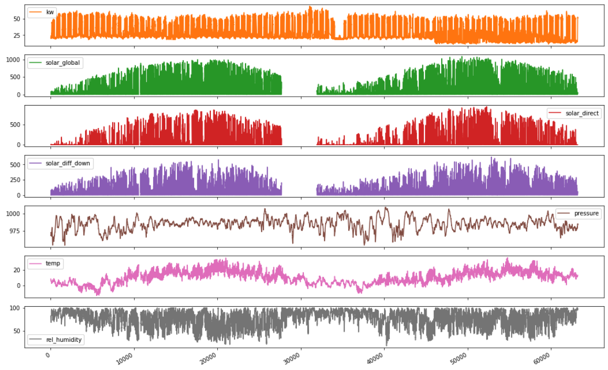

**Anreicherung: ** Insbesondere Für den Random Forest Regressor ist eine Aufspaltung des Zeitstempels in einzelne Spalten vorteilhaft. Die String-Darstellung lässt sich für diesen Algorithmus nicht als Kontinuum interpretieren. Eine Umrechnung in einen einzigen Integer etwa durch Konvertierung in die Unix-Millis-Zeit ist jedoch auch nicht ideal, da dieses Format keinen Bezug zum Wochen- oder Tagesrhytmus herstellt. Aus diesem Grund wurden Monate, Wochen, Tage und Stunden getrennt indexiert. Die Tage konnten schließlich in die Wochentage [1-7] überführt und eine zusätliche Spalte für Feiertage angefügt werden. So wurde aus dem Zeitstempel Information generiert, die eine stärkere Korrelation zwische Stromverbrauch und Aktivitätzyklus im Bürogebäude impliziert.

[**Tabelle 1:** Auszug aus dem angereichertem Trainingsdatensatz]

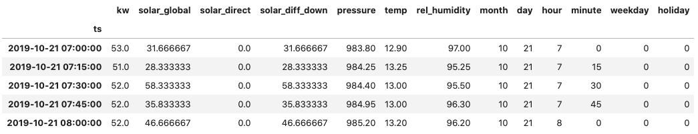

**Normalisierung: ** Für die Eingabe in neuronale Netze sind die Daten in der Regel zu normalisieren. Für den Entscheidungsbaum ist dieser Prozess hingegen nicht ratsam. Auch in der Regressorvarienate kommt der DRF besser mit besser unterscheidbaren Ausprägungen der Features zurecht, da sich bei Semi-kathegorischen Werten tendeziell weniger Äste im Baum ausbilden. Ein Explodieren der Werte innerhalb der Berechnungen ist hier nicht zu erwarten.

## 4.3 Datenteilung

Für die Teilung in Trainings- und Testdaten wurde eine Schwelle von 80% angestrebt. In einer weitere Separierung der 20% Testdaten in Test- und Validierungsblöcke wurde in diesen Experimenten verzichtet. Eine unvoreingenommene Bewertung der Ergebnisse durch den Test mit Daten, die nicht bei Modellselektion und Hyperparamtertuning beteiligt sind, ist im Produktiveinsatz anzuraten, für diese Studie aber nicht essenziell.

**DRF: ** Für das Vergleichmodell wurden zwei unterschiedliche Teilungsmethoden getestet: Der erste Durchlauf wurde über ein zufälliges Samplen der Trainigsdaten gespeist. Dies hat im Schnitt ein effektiveres Training zut Folge, da der ganze Zeitrahmen erfasst wird. Allerdings sind die restlichen Daten für das Testen nicht über einen dichten, kontinuierlichen Zeitraum verteilt, was eine visuelle Bewertung der Plots - z.B. durch Gegenüberstellung mit den Wochentagen - deutlich erschwert. Daher wurde eine weitere Teilung durch Abschneiden von ganzen Wochen vorgenommen. Die Vorhersage arbeitet hier vom Featureraum der Wetter- und Zeitspalten `X` hin zum KW `y` (zeitgleiches Model). Also ist dieK KW-Spalte als Label abzulösen.

**RNN (many-to-one):** Die Zusammenstellung eines Datensatzen für ein rekurrentes Netzwerk gestaltet sich etwas komplexer. Hier sind die Eingabevektoren Sequenzen (in diesem Fall mit nur einem Feature - KW). Somit mussten aus den Rohdaten ganze Zeitintervalle extrahiert werden. Diese Vektoren können dann zu einer Matrix "zusammengeschoben werden". Die Sequenzen von gleicher Länge werden somit gestapelt. Als Label ist die letzte Spalte dieser Matrix zu isolieren, da Eingabe- und Zieldaten sich nur durch die zeitliche abfolge unterscheiden. Bei diesem Vorgehen wird über eine Eingabesequenz X<sub>i</sub> nur eine Zielzeitpunkt y<sub>i</sub> berechnet - es handelt es sich somit um eine Many-to-One-Prognose. 

[**Abbildung 9:** Problemkonfigurationen bei RNNs]


**RNN (many-to-many):** Alternativ können mehrere Spalten am Ende der Matrix abgeschnitten werden, um eine Many-to-Many-Konfiguration zu erziehlen. In diesem Fall ist aber auch ein neues Modell zu erzeugen, das aus einer einzelnen Sequenz eine Folgesequenz generiert. Dieses Netz unterscheidet sich deutlich von einem Many-to-One-Aufbau, da die Ausgabeschicht (Denke) nicht nur mehrere Knoten aufweist, sondern zeitlich entkoppelt, wiederholt angewendet wird. Daher besitzt dieses Netz deutlich mehr Parameter und provoziert eine lange Trainingsdauer. Um dem entgegen zu wirken, wurde die Auflösung der Daten auf stündliche Intervalle runtergerechnet. Es ist dann möglich eine Zeitraum von zwei Wochen mit 336 statt vorher 1344 Samples abzubilden. Zwei Wochen sind vermutlich eine gute Sequenzlänge, da sich entscheidende Werktagszyklen über diesen Zeitraum darstellen. 

## 4.4 Aufbau und Training RNN-Modell (many-to-one)

Ein RNN-Modell lässt sich in Keras realtiv einfach zusammensetzen, da das Framework bereits vorgefertigte RNN-Layer bereit stellt. In diesem Bespiel wurden drei Hidden-Layer mit jeweils 40 Neuronen gewählt. Die Eingabesequenz ist 20 Zeitstempel lang. Der Tangens hyperbolicus als Aktivierungsfunktion findet sich in vielen RNN-Anwendungen, da er en Explodieren der Daten verhindert - nicht aber den Gradientenschwund. Der Aufbau wird durch einen Dense-Layer abgeschlossen, der den einzelnen Ausgabewert y<sub>t + 1</sub> produziert.

[**Auszug Code 1:** Keras Konstruktion RNN-Modell (many-to-one)]

```python
rnn_model = Sequential()
rnn_model.add(SimpleRNN(40, activation='tanh', return_sequences=True, input_shape=(X_train.shape[1], 1)))
rnn_model.add(Dropout(0.15))
rnn_model.add(SimpleRNN(40, activation='tanh', return_sequences=True))
rnn_model.add(Dropout(0.15))
rnn_model.add(SimpleRNN(40, activation='tanh', return_sequences=False))
rnn_model.add(Dropout(0.15))
rnn_model.add(Dense(1))
rnn_model.summary()
```

[**Tabelle 2:** Keras Zusammenfassung RNN-Modell (many-to-one)]

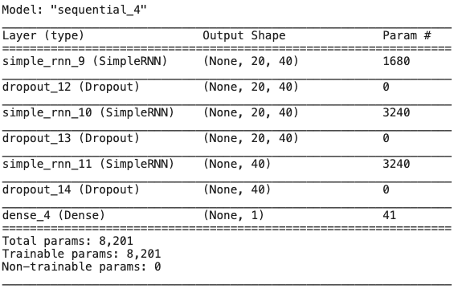

Nach Kompilieren des Modell wurde das Training über 10 Epochen bei einer Batch-Größe von 1000 Sequenzen angestoßen. Das Training reduzierte den Mean-Squared-Error-Loss via Adam-Optimierer stringent von 0,1313 auf 0,0056.

## 4.5 Aufbau und Training LSTM-Modell (many-to-one)

Das LSTM-Modell lässt sich in Keras in analoger Weise zum RNN zusammensetzen. Wir verwenden hier jedoch den LSTM-Layer. Interessant ist, das dieses Modell bei gleicher Neuronenzahl über ca. die 4-fache Anzahl an Parametern  verfügt. Das Training bracht dementsprechend auch die 3-fache Zeit. Es reduziert den Kosten von 0,0335 auf 0,0040.

[**Tabelle 3:** Keras Zusammenfassung LSTM-Modell  (many-to-one)

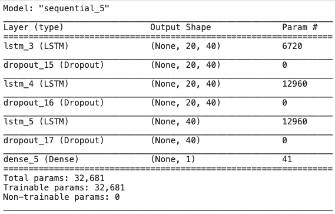

## 4.6 Aufbau und Training rekurrente Modelle (many-to-many)

Der Aufbau einer Many-to-Many-Konfiguration kann in Keras mit dem TimeDistributed-Layer erreicht werden. Dieser sorgt dafür, das der Dense-Layer für die Ausgabe auch tatsächlich bei jedem Zeitstempelschritt neu angewendet wird. Würden wir die dichte Ausgabeschicht nicht derart entkoppeln, dann würde sie auf alle Ausgaben des LSTM-Layers in einem Verbund angewendet. Dies entspräche dann aber nicht mehr der rekurrenten Logik, sondern mehr einer Schiebefenster-Systematik mit klassischem Feedforward-Netz. Im diesem letzten Fall wären nur zeitversetzte Ein- und Ausagben über ein dichtes Netz verknüpft. Das LSTM hingegen soll mehrfach einzelne Ausagbewerte rekurrent berechnen, um die Sequenz zu erstellen.

 [**Abbildung 10:** Schiebefenster Konfigaration - FNN oder LSTM (many-to-many)]

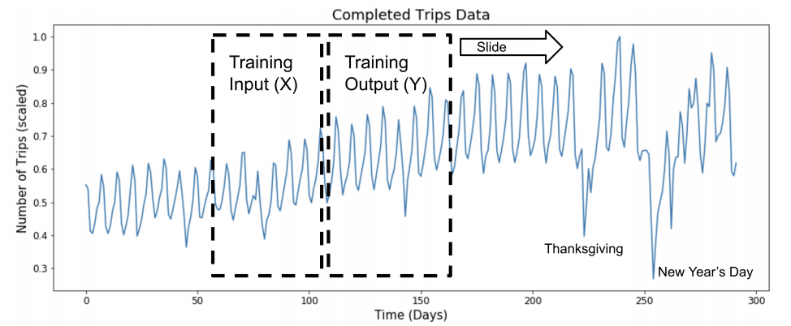

[**Auszug Code 2:** Keras Konstruktion LSTM-Modell (many-to-many)]

```python
lstm_model_mtm = Sequential()  
lstm_model_mtm.add(LSTM(320, input_dim=1, return_sequences=True))  
lstm_model_mtm.add(TimeDistributed(Dense(1)))
lstm_model_mtm.add(Activation('linear'))   
lstm_model_mtm.summary()
```

Interessant wird auch die Zahl der Neronen im Hidden-Layer (im Codebeispiel 2: 320). Im Experiment wurde diese Zahl stark variiert, da sie das Ergebnis massiv beeinflusst. Es ist hierbei in keiner Form zwingend, die Anzahl der verstecken Neuronen gemäß der Länge der Input-Sequenz auszurichten.

## 4.6 Training Random Forest Regressor

Der Random Forest Regressor kann direkt aus der SciKit-Learn-Bibliothek instanziiert werden. Dem Modell sind nur die passenden Hyperparameter zu übergeben. 

[**Tabelle 4:** SciKit-Learn Zusammenfassung Random Forrest Regressor]

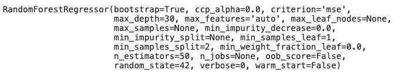

***

# 5. Evaluierung

Für diese Arbeit wurden eine Reihe von Experimenten mit unterschiedlichen Modellen durchgeführt. Somit steht neben den verwandten Modelle, RNN und LSTM, auch das auf dem Entscheidungsbaum basierende Regressionsverfahren zum Vergleich. Wir evaluieren also neben den Varianten rekurrenter Netze auch den Past-to-Future-Ansatz als solchen. Der Vergleich muss hier aus Platzgründen kurz gehalten werden. Daher wird vor allen auf die qualitative Gegenüberstellung der wesentlichsten Plots gebaut. Ausschweifende Listung von Metriken und Fehlerquotienten sollen hier vermieden werden. Zur besseren Einsicht der Merkmale wurden zwei Wochen aus den Prognosekurven selektiert.

## 5.1 Random Forest Regressor

[**Abbildung 11:** 2 Wochen zufällige Prognosesamples - Random Forest Regressor]

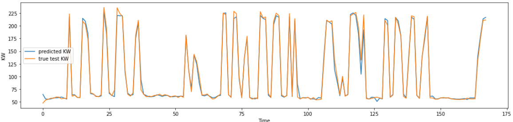

[**Abbildung 12:** 2 Wochen Prognosesqeuenz mit Werktagzyklus - Random Forest Regressor]

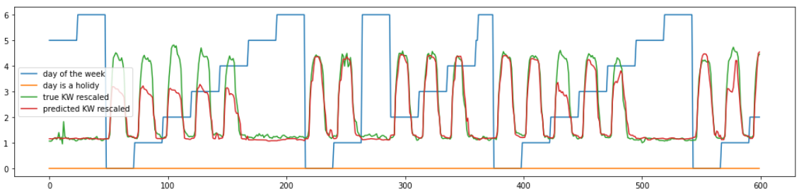

Der Random Forest Regressor funktioniert erstaunlich gut: Schienbar lassen sich durch die via Datenanreicherung erzeugten Zeitmerkmale sehr gut einzelne Muster für den Stromberbrauch ableiten. Insbsondere die plane Niedriglast am Wochenende wird sehr sicher vorhergesagt. Jedoch ist zu erwähnen, das ein zufälliges Samplen der Trainingsdaten hier einen deutlich geringeren Fehler erzeugte (nRSME von 2,58%). Beim Abtrennen von kompakten Wochen kommt es zu größeren Abweichung: Ganze Wochen werden durchgängig mit gleichem, zu niedrigem Verbrauch angesetzt (nRSME von 10,02%). Es entsteht der Eindruck, dass sich historische Muster zu direkt in die Prognose stempeln. Dies wäre aber noch im Detail zu prüfen.

## 5.2 Many-to-One RNN und LSTM

[**Abbildung 13:** 2 Wochen Prognosesqeuenz - RNN (many-to-one)]

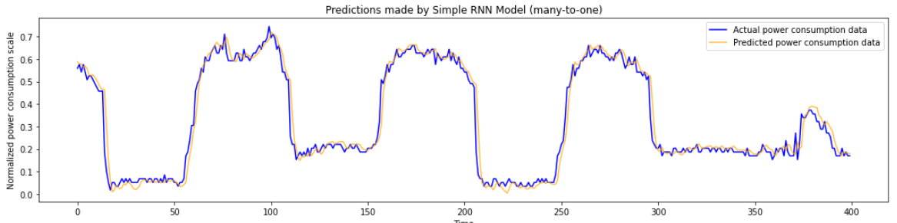

Bei der Gegenüberstellung von Prognose- und Testdaten beim RNN in der Many-to-One-Konfiguration, kommt zunächst Begeisterung auf. Die Kurven liegen sehr dicht beieinander, nur eine leichter zeitlicher Versatz ist sichtbar. Die Prognosedaten schleppen hinterher. Die Ergebnisse des LSTMs unterscheiden sich in diesem Experiment nur marginal: Es ist sogar eine minimale Verschlechterung durch das erweiterte Gedächtnis zu beobachten.

Bei näherer Überlegung wird jedoch klar, das die Modelle für den Anwendungsfall wenig leisten: Schließlich kann zu einem Zeitpunkt t in der Produktionsumgebung nur ein einziger Wert für t+1 berechnet werden. Dies ist verhälnismäßig einfach, wenn der Zustand der jüngsten Vergangenheit bekannt ist. Der Versatz zeigt deutlich, dass das Modell vor allem auf schon real gewordene Veränderungen reagiert. Die Mustererkennung über einen Zeitraum von zwei Wochen kann zunächst nicht nachgewiesen werden. Eine Sequenz entsteht in diesem Experiment nur, weil die Testdaten als Paket eine kontinuierliche Sequenz erzeugen. Das einzelne Testdatum hat hingegen kaum Prognosekraft im Sinne der Aufgabenstellung.

**Anmerkung:** Die große Anzahl der Beiträge im Internet, die genau einen solchen Aufbau für die Vorhersage von Sequenzen vorstellen, zeigt, dass eine passende Kurve leicht zu Fehleinschätzungen führen kann: Ohne technische Durchdringung der Problemstellung wird hier aufgrund einer vermeintlichen Genauigkeit das falsche Verfahren gewählt, welches keine Zeitreihe sondern einen Einzelwert erzeugt.

## 5.3 Many-to-Many RNN und LSTM

Die Many-To-Many-Konfiguration von rekurrenten Netzen fasst nun die Problemstellung: Für jede Sequenz der Eingabe wir eine gleichlange Sequenz in die Zukunft projeziert. Hier wird die intelligente Mustererkennung richtig gefordert: Dementsprechend zeichnet zich beim RNN zunächst ein schlechteres Bild. Auch wenn eine Aufnahme der Rhytmik zu erkennen ist, sind doch die Amplituden stark verfälscht. 

[**Abbildung 14:** 2 Wochen Prognosesqeuenz - RNN (many-to-many) - 320 Hidden Neurons]

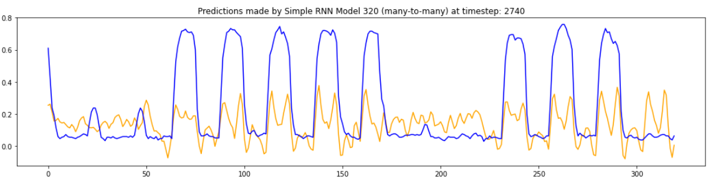

Das LSTM scheint hier seine längeres Gedächtnis auszuspielen, um den eigentlichem Zyklus der Wochentage zu erkennen. Die Kurve trifft die Amplituden deutlich besser und beschreibt auch die Talsohle am Wochenende im Prinzip. Interessant ist aber, das der Graph deutlich winiger Mikroamplituden zeigt. Das LSTM scheint die Eigenschaften etwas zu stark zu glätten, was insbesondere bei den steilen Anstiegen am Wochenbeginn und -ende zu größeren Fehlern führt. Dennoch ist das LSTM dem RNN zu diesem Zeitpunkt klar überlegen.

[**Abbildung 15:** 2 Wochen Prognosesqeuenz - LSTM (many-to-many) - 320 Hidden Neurons]

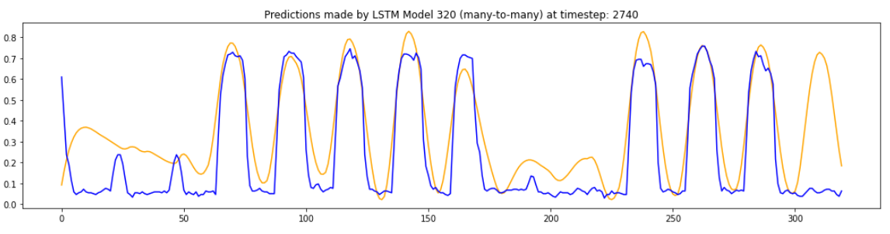

[**Abbildung 16:** 2 Wochen Prognosesqeuenz - RNN (many-to-many) - 20 Hidden Neurons]

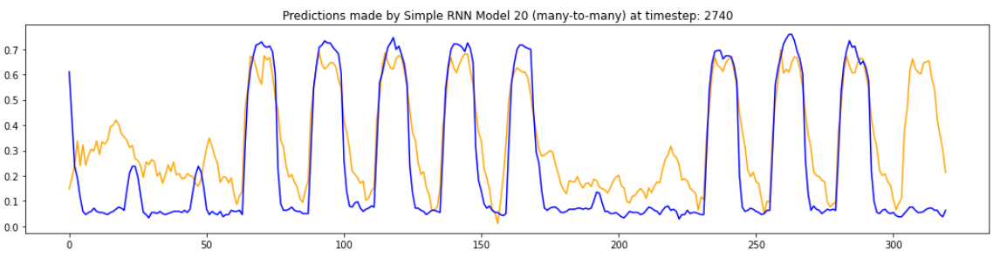

Ein überraschendes Resultat erbringt schließlich die Reduktion der Neuronen im Hidden-Layer des RNNs von 320 auf 20. Bei dieser Zusammnesetzung, kann selbst das RNN nun relativ Präzise den Amplitudenzyklus der Wochentage replizieren. Dies zeigt, dass ein RNN dem LSTM nicht grundsätzlich unterlegen sein muss. Vielmehr spielt der genaue Aufbau in Zusammenhang mit der Problemstellung un den vorhandenen Daten eine eintscheidende Rolle. Es muss hierbei erwähnt werden, dass die Breite an Möglichkeiten von Einstellungen und Kombinationen in dieser Arbeit kaum berührt werden konnte.

# 6. Fazit

## 6.1 Zusammenfassung

Die Reihe an Experimenten mit den rekurrenten Netzen, RNN und LSTM, hat gezeigt, dass eine Zeitreihenanalyse über die Mustererkennung in Sequenzen zumindest sinvolle Prognosen liefert. Interessant sind diese Modelle insbesondere für Anwendungsfälle, wo keine weiteren Daten als der historische Verlauf der fortzuschreibenden Kurve gegeben sind. Dabei können RNN und LSTM  durchaus auch mit einem größeren Featureraum umgehen und dann durch diese anderen Merkmale noch komplexere Muster und Zusammenhänge identifizieren.

Ein klarer Gewinner in der Gegenüberstellung von RNN und LSTM ist nicht festgestellt worden. Für den Einsatz zur Vorhersage von Stromverbrauchszyklen scheinen beide Versionen im Grundsatz geeignet, auch wenn eine sehr genaue Anpassung der einzelnen Schichten vorzunehmen ist. Das LSTM liefert gerade beim schnellen Testen ohne Tuningdurchläufe zuverlässiger akzeptable Ergebnisse. Die Anzahl der Parmeter liegt hier aber deutlich höher, was das Training und auch die Reaktionszeit bei der Vorhersage verlängert. Die Genauigkeit des RNNs in der Many-to-Many-Konfiguration schwankte wesentlich stärker, wenn die Neuronenzahl im Inneren variiert wurde. Allerdings wären genaue Aussagen, bei der Menge an getesteten Zusammanstellungen  verfrüht.

Als überraschend präzise erwies sich der Random Forest Regressor im Zusammnspiel mit einer inhaltlich fundierten Datenanreicherung. Es muss hier nocheinmal ausdrücklich erwähnt werden, dass eine Spaltung der Zeitstempel in semi-kathegorische Werte für zyklische Zeitvariablen (Wochentag, Tagesstunde, Feiertage) die Prognose entscheidend unterstützt. Diese Variablen bilden einen Feature-Raum, der bei einem zeitgleichen Experiment ein Stempeln von vergangenen Seuquenzen in die Zukunft ermöglicht. Es ist zu vermuten, das dieser Ansatz scheitert, wenn sich Muster nicht mit den Schleifen dieser repetitiven Zeitwerte decken. In dieser Hinsicht ist der Stromverbrauch eines Bürokomplexes ein Idealfall. Auch bleibt zu untersuchen, ob die genutzten Wetterdaten tätsachlich einen eher geringen Einfluss auf den Entscheidungswald hatten.

## 6.2 Ausblick

Diese Arbeit stellt eine erste Grundsatzuntersuchung für die Eignung der rekurrenten neuronalen Netze für die Prognose von Stromverbrauchsdaten dar. Sie muss bei dem gegebenen Umfang an der Oberfläche bleiben. Dennoch wäre eine deutlich genauere Untersuchung der angedeuteten Zusammenhänge denkbar:

- Es bliebt zu klären ob eine Konfiguration von RNN und LSTM gefunden werden kann, die die Eigenschaften der Daten noch besser erfasst. Dies ist besonders interessant, da für den Stromverbrauch durch Domänenwissen schon intuitive Annahmen getroffen werden können. Korrelationen mit den Tageszyklen durch Arbeitsaktivitat im Büro sind doch sehr offensichtlich. Desto spannender ist die Frage, wann ein Modell diesen einfachen Zusammenhang lernen kann.
- Bei der Many-to-Many-Konfiguration gibt es noch offene Fragen. Der genaue Mechanismus der Zeitreigengeneration ist zu überprüfen, da die wiederholte Anwendung des Denke-Layers noch etwas unpassend erscheint. Die Erforschung von Encoder-Decoder-System sollte hierbei weitere Erkenntnisse liefern. Die wirkliche Entkopplung des Lese- und Schreibprozesses ist eventuell relevant, wenn eine Sequenz vollständig analysiert werden muss, um diese präzise fortzuschreiben.

[**Abbildung 17:** Encoder-Decoder Systematik]


# 7. Anhang

## 7.1 Abbildungsverzeihnis

[**Abbildung 1:** Prognosekurven für die Leistung einer PV-Anlage]

[**Abbildung 2:** Prognosekurven für Passagiere via LSTM]

- Quelle: https://medium.com/swlh/a-quick-example-of-time-series-forecasting-using-long-short-term-memory-lstm-networks-ddc10dc1467d

[**Abbildung 3:** RNN in zyklischer und entfalter Systemdarstellung]

- Quelle: https://www.knime.com/blog/text-generation-with-lstm

[**Abbildung 4:** RNN Netzwerkverbindung und Tansfer zum Systemdiagramm]

- Quelle: https://data-science-blog.com/blog/2020/06/01/prerequisites-for-understanding-rnn-at-a-more-mathematical-level/

[**Abbildung 6:** Verschaltung RNN vs LSTM]

- Quelle: https://github.com/topics/gtzan-dataset

[**Abbildung 7:** LSTM-Zelle mit Gates als Funktionen]

- Quelle: https://towardsdatascience.com/multiclass-text-classification-using-lstm-in-pytorch-eac56baed8df

[**Abbildung 8:** Zeitreihendaten Wetter und Stromverbrauch]

[**Abbildung 9:** Problemkonfigurationen bei RNNs]

- Quelle: https://stackoverflow.com/questions/43034960/many-to-one-and-many-to-many-lstm-examples-in-kerasQuelle:

[**Abbildung 10:** Schiebefenster Konfigaration - FNN oder LSTM (many-to-many)]

- Quelle: https://machinelearningmastery.com/lstm-model-architecture-for-rare-event-time-series-forecasting/

[**Abbildung 11:** 2 Wochen Prognosesamples - Random Forest Regressor]

[**Abbildung 12:** 2 Wochen Prognosesqeuenz mit Werktagzyklus - Random Forest Regressor]

[**Abbildung 13:** 2 Wochen Prognosesqeuenz - RNN (many-to-one)]

[**Abbildung 14:** 2 Wochen Prognosesqeuenz - RNN (many-to-many) - 320 Hidden Neurons]

[**Abbildung 15:** 2 Wochen Prognosesqeuenz - LSTM (many-to-many) - 320 Hidden Neurons]

[**Abbildung 16:** 2 Wochen Prognosesqeuenz - RNN (many-to-many) - 20 Hidden Neurons]

[**Abbildung 17:** Encoder-Decoder Systematik]

- Quelle: https://jeddy92.github.io/JEddy92.github.io/ts_seq2seq_intro/

## 7.2 Verzeihnis Code-Auszüge

[**Auszug Code 1:** Keras Konstruktion RNN-Modell (many-to-one)]

[**Auszug Code 2:** Keras Konstruktion LSTM-Modell (many-to-many)]

## 7.2 Formelverzeichnis

[**Formel 1:** Mathematische Beschreibung eines RNN]

## 7.3 Tabellenverzeichnis

[**Tabelle 1:** Auszug aus dem angereichertem Trainingsdatensatz]

[**Tabelle 2:** Keras Zusammenfassung RNN-Modell  (many-to-one)]

[**Tabelle 3:** Keras Zusammenfassung LSTM-Modell  (many-to-one)]

[**Tabelle 4:** SciKit-Learn Zusammenfassung Random Forrest Regressor]

